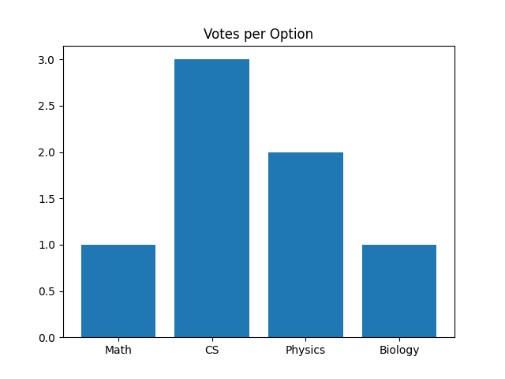
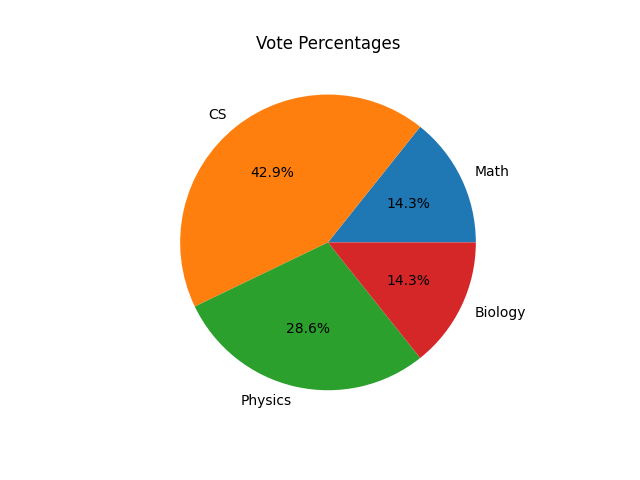
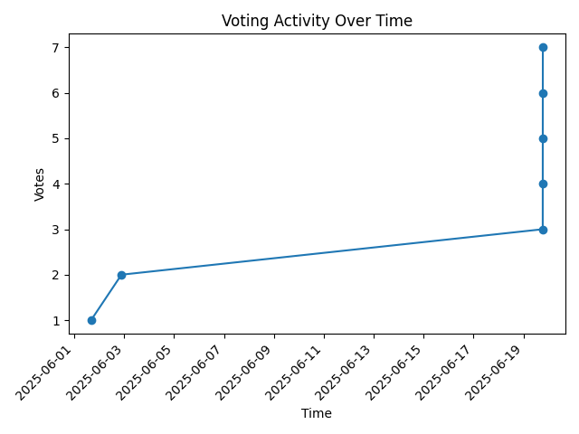
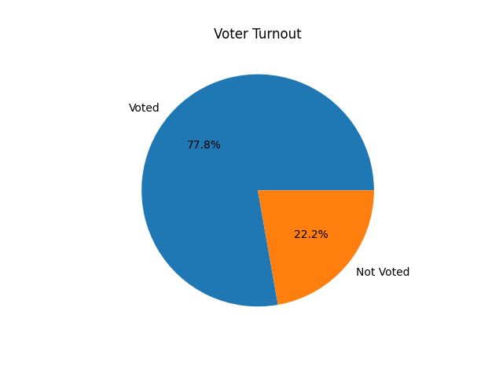

# 📊 Charts

The **Charts** page provides a visual summary of voting results for each session. These charts are generated server-side using Matplotlib and reflect a static snapshot of the voting data at the time of the request. They offer a clear, visual interpretation of how votes were distributed during the session.

Currently, four types of charts are supported:

---

### 🟦 1. Bar Chart – Votes per Option

Displays the total number of votes each Option received in a given voting session.

**Use case:** Quickly compare Option popularity by count.

---

### 🟪 2. Pie Chart – Vote Share by Option

Shows each Option’s share of the total votes as a percentage.

**Use case:** Understand vote distribution at a glance.

---

### 🟩 3. Line Chart – Voting Activity Over Time

Plots the number of votes cast over time within a session.

**Use case:** Spot peaks and patterns in voter activity.

---

### 🟨 4. Turnout Chart – Voted vs Registered Users

Compares how many registered users actually voted in the session.

**Use case:** Measure overall participation and engagement.

---

## 🔗 Where to View Charts

Charts are available during and after a voting session.

**Live example:**  
[https://iovote.onrender.com/voting_sessions/session/2/charts/](https://iovote.onrender.com/voting_sessions/session/2/charts/)

> Replace `2` with the ID of any voting session.

**Relative path (for developers):**
/voting_sessions/session/<session_id>/charts/

---

## 🖼️ Chart Previews (Optional)

> You may include screenshots of each chart type here for documentation or PDF purposes.

To enable once images are added:
### Example Previews

---

## 🛠️ Technical Notes

- Charts are generated using **Matplotlib** on the Django backend.
- They are returned as static PNG images embedded in the results page.
- No JavaScript or interactivity is used — this keeps the charts lightweight and server-driven.

---

## 📌 Future Enhancements

- Introduce interactive charts using JavaScript libraries (e.g., Chart.js, Plotly)
- Enable image or PDF export of individual charts
- Add multi-session comparisons for analytics

---

Need help extending chart features or including visuals in your PDF documentation? Just let us know.
